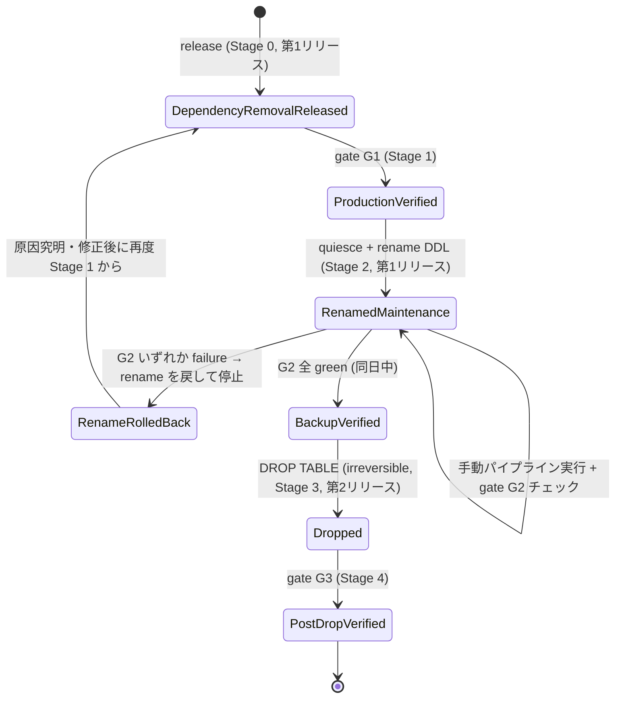

# AccountLabel テーブル退役設計

- Status: written spec approved（ユーザーが引き続き実行を承認）。spec-review 完了 (spec-reviewer 済み)。
- Author: design agent (spec-only, no production/runtime change in this turn)
- Scope repo: twitter-accounts-classifier
- Baseline: master `8d72a6a` (DB growth root fix v0.61.0)

## 1. 背景と確定事実 (Facts)

現在の master (`8d72a6a`, PR #289) により、以下がすでに本番へデプロイ済みで健全に稼働している。

- `AccountLabelLatest` が現在値の唯一の read source であり、dashboard/一覧/account-detail の value 表示はすべてここから読む。
- `AccountLabelChange` は `AccountLabelLatest` への INSERT/UPDATE を契機とする DB トリガー
  (`account_label_latest_change_audit_trigger`, migration `20260906010000`) が生成する、
  **value 遷移のみ**を記録する監査ログである。トリガーは次の場合のみ行を生成する。
  - `INSERT` かつ `NEW.value = true`: `changeType='added'`、`previousValue=NULL`。
  - `UPDATE` かつ `OLD.value IS DISTINCT FROM NEW.value`: `changeType='added'|'removed'`。
  - confidence/reason/method/ruleVersion/evaluable のみの変化 (value 不変) は行を生成しない
    (意図的な設計、既存の受理済み決定であり本設計で再検討しない)。
  - `AccountLabelChange` に `method`/`ruleVersion` カラムは存在しない
    (`prisma/schema.prisma` L997-1016)。
- crawl 経路の不変ハンドオフは `AccountClassificationObservation.snapshotVersion=1` +
  `classificationSnapshot`(JSON) であり、`recordCrawlAccountLabelsAtomicWithinTx`
  (`crawler/db/label-repository.ts`) が crawl transaction 内で
  `AccountLabelLatest` を FOR UPDATE 込みで再読込し、その内容を確定値として保存する
  (relabel による後続上書きの影響を受けない)。
- analyzer の `processAccountSummaryRefresh` (`analyzer/worker-processors.ts`) は
  `observation.snapshotVersion === SUPPORTED_ACCOUNT_CLASSIFICATION_SNAPSHOT_VERSION` の場合のみ
  snapshot を使い、そうでない場合 (snapshotless Observation) は
  `findLabelsAtWatermarkForAccount`/`findPreviousLabelAtWatermarkForAccount`
  (`analyzer/read-models/build-account-summary-latest-row.ts`) で **生の `AccountLabel` を直接クエリ**し、
  `sourceLabelId` を冪等キーとして `AccountLabelChange` へも書き込む
  (レガシー watermark 復元経路が `AccountLabelChange` の生成元を兼ねている)。
  本番の snapshotless nonterminal 件数は現在 0 (ドレイン完了) であり、この経路は現状ホットパスではないが、
  コードとしては現存し `AccountLabel` への実クエリを保持している。
- crawl 経路は現在も無条件で raw `AccountLabel` へ INSERT している。
  `recordCrawlAccountLabelsAtomicWithinTx` → `recordAccountLabelsBulkCore` の SQL が
  `AccountLabel` への `INSERT` と `AccountLabelLatest` への `UPSERT` を 1 CTE にまとめて実行するため
  (`crawler/db/label-repository.ts` L170-227)、claim が成立した author は毎回 history 行が増える。
  **`recordAccountLabelsBulkCore` の戻り値 `{ history: AccountLabel[] }` は
  `recordCrawlAccountLabelsAtomicWithinTx` 側で呼び出されているが結果は破棄されており
  (`await recordAccountLabelsBulkCore(...)` の戻り値を未使用)、
  classificationSnapshot は別途 `AccountLabelLatest` を再 SELECT して構築している。**
  つまり crawl 経路の history 配列に実行時の依存はなく、history INSERT を止めても
  snapshot 構築ロジックへの副作用はない。
- relabel 経路はすでに Phase A/B 切替を持つ:
  `RELABEL_ACCOUNT_LABEL_HISTORY_WRITE_ENABLED` (既定 true、本番は false)
  により `recordAccountLabelsBulkForAccounts`(history+Latest) と
  `recordAccountLabelsBulkLatestOnlyForAccounts`(Latest のみ) を切り替える
  (`crawler/relabel-worker.ts` L296-300)。crawl 経路にはこの切替が存在しない
  (`recordCrawlAccountLabelsAtomicWithinTx` は無条件で `recordAccountLabelsBulkCore` を呼ぶ)。
- `recordCrawlAccountLabel` (単数形、`crawler/db/label-repository.ts` L414-475) は
  本番コードから呼ばれておらず (`author-checkpoint-repository.ts` は
  `recordCrawlAccountLabelsAtomicWithinTx` のみを呼ぶ)、自身のテストファイル以外に
  呼び出し元が存在しない。事実上の死んだコードであると確認した。
- viewer の `getAccountDetail` (`viewer/lib/queries/account-detail.ts`) は
  `AccountLabelLatest` から現在値を取得しつつ、`AccountLabel` を
  `labeledAt desc, id desc` で最大 2000 行取得し、
  `groupLabelsByDefinition`/`buildLabelHistoryByDefinition` で
  「各 labelDefinitionId ごとの最新行 1 件を除外し、残りを history として最大 20 件表示する」
  ロジックで再構築している。history の各行は `value, confidence, reason, method, ruleVersion, labeledAt`
  を持つ。UI (`viewer/app/components/account-labels.tsx`) はこれをそのまま列挙表示する。
- `blocker/db/candidate-repository.ts` は raw `AccountLabel` 履歴を参照しない設計であることが
  コード内コメントで明言されている (既存の非依存を追加確認)。
- 現行 schema (`prisma/schema.prisma` L132-155) の `AccountLabel` は
  `@@index([accountId])` と `@@index([sourceKind, sourceId])` のみを持つ (他の index は既存 PR で削除済み)。
- `scripts/db/` にロール同期スクリプト一式が存在する
  (`create-analyzer-role.sql`/`create-viewer-role.sql`/`create-weekly-review-role.sql`、
  `sync-analyzer-grants.sql`/`sync-viewer-grants.sql`/`sync-weekly-review-grants.sql`、
  `run-migration-and-sync-grants.sh`)。`sync-analyzer-grants.sql`/`sync-viewer-grants.sql` は
  いずれも `GRANT SELECT ON ALL TABLES IN SCHEMA public` で全テーブルへの読み取りを許可したうえで、
  write は明示 allowlist のみに限定する方式であり、`AccountLabel` を名指しした GRANT/REVOKE 行は
  存在しない (allowlist に `AccountLabel` は含まれず、analyzer/viewer とも `AccountLabel` へは
  ブランケット SELECT のみを持つ)。`crawler` ロールには専用の `create-crawler-role.sql`/
  `sync-crawler-grants.sql` が存在せず、`sync-crawler-runtime-settings.sql` が
  `ALTER ROLE crawler SET ...` のみを行う。これは crawler が migration を実行する
  テーブル所有者ロール (owner-like、DML/DDL 双方を持つ) として運用されていることを示唆する
  (各 sync スクリプトのコメントが「Prisma migration を実行するテーブル所有者ロールで実行する」と
  明記している)。本番 DB の実際の GRANT 状態がこれらスクリプトの定義と一致していること
  (ドリフトがないこと) は 2026-09-07 の本番読み取り専用チェックで確認済み (§7.3 参照)。
- 既存 migration の慣行として、CONCURRENTLY を要する DDL は必ず単一ステートメントの
  専用 migration ファイルに切り出されており、`lock_timeout`/`statement_timeout` を
  migration.sql 内で明示的に `SET` している前例はない。
- **本番バックアップ体制の確認事実**: 本番 PostgreSQL は `archive_mode=off` であり、
  WAL アーカイブ/PITR は運用されていない。pgBackRest/restic/borg 等の継続的バックアップ
  ツールも導入されていない。したがって本設計では PITR の存在を前提にできない
  (§6/§7.2 で扱う DROP 前提のバックアップは、この事実に基づき pg_dump ベースの
  一時的な論理バックアップに置き換える)。ホスト `/mnt/hdd` の空き容量は 394GB であり、
  `AccountLabel` の概算サイズ (約 148〜160GB) に対し、custom 形式 (`pg_dump -Fc`) の
  圧縮を考慮しても十分な余裕がある。
- **DB カタログによる依存確認 (2026-09-07 実施済み)**: `AccountLabel` に対する
  inbound FK (`pg_constraint.confrelid`)、当該テーブルに依存する VIEW/MATERIALIZED VIEW
  (`pg_depend`)、論理レプリケーション publication (`pg_publication_tables`)、
  当該テーブルを参照する関数 (`pg_depend`/`pg_proc` 経由) のいずれも本番 DB で **0 件**
  であることを確認済み。§7.1 で懸念していた「grep では検出できない DB 側の依存」は、
  この本番カタログ確認によって解消されている。

## 2. Outcome / Success Criteria

**Outcome**: `AccountLabel` への生き残った実行時依存 (crawl の書き込み、viewer の読み取り、analyzer legacy fallback の読み取り、Prisma モデル定義) を **rename より前にすべて除去** したうえで、`AccountLabel` を `AccountLabelLegacy` へリネームし、同日中のメンテナンス確認で安全性を実測してから DROP し、約 148GB (オーダーとして概算、正確な値は保証しない) のストレージを回収する。

**Success Criteria**:

1. crawl・relabel 双方の経路が `AccountLabel` へ新規行を書き込まなくなり、Stage 0 の単一リリースで書き込みコード自体・関連する既存フラグ (`RELABEL_ACCOUNT_LABEL_HISTORY_WRITE_ENABLED`) ごと削除されている (機能フラグによる再有効化可能な分岐は追加しない。ロールバックはコード revert による、§6)。
2. viewer のアカウント詳細ページの履歴表示が `AccountLabelChange` のみから構築され、
   `AccountLabel` への読み取りクエリがコードベースから消える。
3. analyzer の snapshotless fallback (旧 `findLabelsAtWatermarkForAccount` 系) が rename より前に完全に削除されており、`AccountLabel` を読むコードパス自体が存在しない。
4. リネーム後、本番の全サービス (crawler/analyzer/viewer/blocker/review/queue/storage/GlitchTip) が
   `AccountLabelLegacy` という名前への意図しないアクセスを一切発生させないことを、rename 実行と同日のメンテナンス確認 (§12 G2) で証明する。
5. DROP 後、ディスク空き容量が有意に増加し、DB 側のテーブル一覧から `AccountLabel`/`AccountLabelLegacy`
   が消えており、他の read model・crawl・relabel・review・GlitchTip の健全性が DROP 前後で変化しない。
6. 各段階に明確なロールバック手順があり、DROP のみが不可逆であることが明記されている。

## 3. Scope / Non-goals

**Scope**: `AccountLabel` テーブルへの実行時依存除去 (rename 前に完了)、rename + 同日メンテナンス確認、DROP、
関連する静的検査・contract test・本番ゲートの設計。

**Non-goals (明示的除外)**:

- `AccountLabelLegacy`/`AccountLabel` への `VACUUM FULL` は行わない。
- パーティショニングの retrofit は行わない。
- 旧テーブルへの書き戻し・backfill・rewrite は行わない。
- `AccountLabelLatest` を sparse (部分行のみ保持) にする変更は行わない。
- 本件と無関係な GlitchTip Crawl warning しきい値 issue の解消は行わない
  (DB growth に直結し再発しないと確認できたものだけを resolve する)。
- 実装コード自体の変更 (このターンでは spec のみ)。

## 4. 代替案の検討 (Alternatives Considered)

| 案 | 却下理由 |
| --- | --- |
| 即時 `DROP TABLE "AccountLabel"` | 現在も crawl が書き込み中であり、viewer/analyzer に読み取り依存が残ったまま DROP すると、viewer は 500、analyzer の legacy fallback は例外で work item が dead-letter 化する。依存除去なしの DROP は本番障害に直結するため却下。 |
| `VACUUM FULL "AccountLabel"` でサイズだけ縮小 | `VACUUM FULL` はテーブル全体を排他ロックしながら書き直すため、約 148GB 規模のテーブルでは長時間 `AccessExclusiveLock` を保持し crawl/relabel の書き込みを止める。テーブル自体を退役させる方針の下では、縮小してもいずれ DROP する不要な作業であり、リスクだけを増やす。却下。 |
| パーティショニングへの retrofit | 既存の巨大な単一テーブルをパーティション化するには `pg_partman` 等を使った新テーブルへの移行かオンライン書き換えが必要で、DROP 前提の退役作業には運用コストが見合わない。テーブルは近く消える前提であり、恒久運用を前提にした投資は YAGNI。却下。 |
| `AccountLabel` を残したまま read-only アーカイブ化 (書き込みだけ止めて放置) | ストレージ ~148GB を回収できず、DB growth root fix の本来の目的 (ストレージ確保) を達成しない。中間段階として認めるが最終形にはしない (本設計の rename から DROP までの期間がこれに相当し、恒久状態にはしない)。 |
| **採用: 依存除去 (rename 前に完了) → リネーム + 同日メンテナンス確認 → DROP** | リネームはメタデータのみの操作 (`ALTER TABLE ... RENAME TO ...`) でテーブル書き換えを伴わず、ロック時間が短い。rename より前に依存をすべて除去することで rename 時点の正当な参照を 0 件にでき、rename 後は「本当に誰もアクセスしていないか」を最低 7 日の受動的観察ではなく、同日中に各パイプラインを能動的に手動実行して実測で確認できる (D9)。確認が取れてから初めて不可逆な DROP に進める。 |

## 5. ライフサイクル / 状態機械

**設計変更 (承認済み)**: 「rename してから legacy 依存を消す」のではなく、
**「rename する前に legacy への実行時依存をすべて消す」** 順序に変更する。
rename 時点で `AccountLabel`/`AccountLabelLegacy` への正当な runtime 参照は 0 件であることが
前提になるため、rename 後の確認は「まだ残っているかもしれない依存を最低 7 日観察する」
受動的な窓ではなく、「本当に依存がゼロであることを同日中に能動的に確認する」
メンテナンス作業に置き換える (詳細理由は D9 参照)。**7 日間・日次・週次の待機を要件とする
記述は本設計から全面的に削除する** (D10)。

**リリース回数**: 本設計は本番リリースを実質 2 回に集約する。

- **第 1 リリース**: Stage 0 (依存除去コード) と Stage 2 (rename migration) を含む。
  コードのデプロイと rename DDL の実行タイミングは分離してよい (Stage 1 の G1 検証を
  コードデプロイ後・rename 実行前に本番で行うため) が、リリースパッケージとしては
  1 つにまとめる。
- **第 2 リリース**: Stage 3 の DROP migration のみを含む最終退役リリース。
  Stage 2 の同日メンテナンス確認 (G2) が全 green になった後に着手する。
- **`prisma migrate deploy` の 1 回の実行に rename と DROP の両方の migration ファイルを
  含めない** (pending migration として同時に流さない)。両者を同一実行に含めると、
  途中で失敗した場合にどちらまで適用されたかの切り分けが難しくなり、
  また rename 後の同日メンテナンス確認 (G2) を経ずに DROP まで進んでしまう経路を
  構造的に作ってしまうため。



### Stage 0: Dependency Removal Release (rename 前に完了させる)

rename 実行前に、以下を **すべて** 本番から除去し切る。これが完了して初めて Stage 1 の
検証に進み、rename (Stage 2) に到達できる。

- **crawl 経路・relabel 経路の raw `AccountLabel` 書き込みをどちらも恒久的に撤去する。**
  **機能フラグによる再有効化可能な分岐は追加しない。** 具体的には、以下すべてを
  1 セットのコード削除として実施する (§8):
  - crawl 経路: `recordCrawlAccountLabelsAtomicWithinTx` から
    `AccountLabel` への `INSERT` を行う CTE 分岐そのものを削除する
    (フラグで分岐させるのではなく、`AccountLabelLatest` の UPSERT のみを行う
    SQL に置き換える)。
  - relabel 経路: 既存の `RELABEL_ACCOUNT_LABEL_HISTORY_WRITE_ENABLED` フラグと、
    それが分岐させている `recordAccountLabelsBulkForAccounts`
    (history+Latest 版) を **削除する**。本番では既にこのフラグが `false`
    (Latest のみ) で稼働しているため、`recordAccountLabelsBulkLatestOnlyForAccounts`
    のみが呼ばれる状態を、分岐自体をなくすことでコード上も確定させる。
  - `recordAccountLabelsBulkCore` の戻り値 `{ history: AccountLabel[] }` など、
    使われていない history 関連の戻り値・型・引数を削除する (§1/§8.1 で確認済みの
    死んだコード)。
  - `recordCrawlAccountLabel` (単数形、死んだコード、§1) を削除する。
  上記すべてを rename 前の同一リリースで完了させる (§11 の「production コードに
  `AccountLabel` への参照が一切ない」という静的検査を rename 前の時点で満たす必要があるため)。
- **analyzer の snapshotless fallback と `sourceLabelId` legacy 処理を削除する。**
  `findLabelsAtWatermarkForAccount`/`findPreviousLabelAtWatermarkForAccount`
  および `processAccountSummaryRefresh` の snapshotless 分岐 (`sourceLabelId` を
  冪等キーとして扱うロジックを含む) を、rename を待たずにここで削除する
  (旧稿では「DROP と同一リリース」としていたが、rename 前に依存ゼロを達成する方針に
  合わせてここへ前倒しする、§9)。`AccountLabelChange.sourceLabelId` カラム自体は、
  この削除により書き込み元・読み取り元がともに消える dead カラムになり、
  Stage 3 で `AccountLabelLegacy` の DROP と同一 migration 内でカラムごと DROP する
  (本設計に含める、§7.2/§7.4/§13/D13 参照)。
- **viewer の account-detail history を `AccountLabelChange` ベースに切り替える** (§10)。
- **Prisma schema から `model AccountLabel` および逆参照リレーション
  (`Account.labels`/`LabelDefinition.accountLabels`) を削除する** (§7.4)。
  **この時点ではまだ rename していないため、DB 上のテーブル名は `AccountLabel` のままである。**
  Prisma はモデル定義のないテーブルの存在を許容する (`prisma validate`/`migrate` は
  schema に定義されていないテーブルをエラーにしない) ため、モデル削除だけを
  先に本番へ出すことは安全である。これにより、rename (Stage 2) の migration は
  「Prisma モデルの rename」を一切伴わない **DDL のみの migration** になり、
  旧稿にあった「DDL 適用から Prisma Client 再生成までの window」問題自体が
  構造的に発生しなくなる (§7.1)。
- `scripts/db/sync-analyzer-grants.sql` 冒頭コメントの正本テーブル一覧から
  `AccountLabel` を除去する (§7.3、旧稿では Stage 4 としていたが同様に前倒しする)。

上記すべてが完了した時点で、コードベース上 `AccountLabel` という文字列・Prisma モデル・
逆参照リレーション・機能フラグはどこにも存在しない。これは §11 の静的検査で機械的に確認する
(Stage 0 完了以降、恒常的に満たされる状態になる)。

### Stage 1: Production Verification (Gate G1)

§12 G1 の「crawl/relabel の書き込み量ゲート (低コスト pg_stat 版)」「viewer health」
「analyzer legacy fallback 削除の確認 (コードが存在しないこと自体が確認)」
「snapshotless Observation が新規に発生しないことの静的検査+本番手動確認」を満たす。
Stage 0 が完了しているため、G1 は「もう誰も `AccountLabel` を触っていないこと」の
最終確認という位置づけになる。**7 日間の実測待機は要求しない** (D10)。

### Stage 2: Rename + 同日メンテナンス確認 (Gate G2)

- `ALTER TABLE "AccountLabel" RENAME TO "AccountLabelLegacy";` の DDL のみを実行する
  (Stage 0 で Prisma モデルはすでに削除済みのため、この migration に Prisma schema の
  変更は含まれない。詳細は §7.1)。
- rename 実行後、**同一のメンテナンス作業時間内に** 以下を手動で実行し、
  それぞれが健全に完了することを確認する (§12 G2 のチェックリスト):
  crawl → snapshot 生成 → analyzer (account_summary_refresh)、relabel、
  viewer の account-detail 表示・review 画面、blocker、weekly-review 相当の処理、
  queue/storage の状態確認。
- 上記いずれかの手順で異常 (エラー、`AccountLabelLegacy` への pg_stat アクセス増分、
  GlitchTip での新規 DB/root-fix 関連 issue) を検出した場合、
  **即座に `ALTER TABLE "AccountLabelLegacy" RENAME TO "AccountLabel";` で rename を戻し、
  そのメンテナンス作業を停止する。** 原因を究明・修正したうえで、Stage 1 の検証からやり直し、
  改めて別のメンテナンス作業時間で rename を再試行する。
- 全チェックが green であることを同日中に確認できたら、**7 日間・日次・週次の
  受動的な待機は行わずに** Stage 3 (backup 確認 → DROP、第 2 リリース) へ進んでよい。

### Stage 3: Backup 確認 → DROP (第2リリース)

- DROP 実行前に、`AccountLabelLegacy` 単体を PostgreSQL 17 の `pg_dump --format=custom`
  で `/mnt/hdd` へ論理バックアップとして取得し、sha256 チェックサムの記録と
  `pg_restore` によるアーカイブ健全性確認 (§7.2 の Backup Gate) を **必須** とする。
  **PITR/WAL アーカイブの存在は前提にしない** (§1 のとおり `archive_mode=off` であり
  継続的バックアップ手段が存在しないため)。
- `DROP TABLE "AccountLabelLegacy";` と `ALTER TABLE "AccountLabelChange" DROP COLUMN
  "sourceLabelId";` を **同一の quiesced migration (同一トランザクション)** で実行する
  (不可逆、§6、§7.2)。`sourceLabelId` は analyzer legacy fallback 専用の冪等キーであり、
  Stage 0 でその fallback を削除すれば書き込み元・読み取り元がともに消えるため、
  今回の退役に含める (D13)。unique index (`sourceLabelId String? @unique`) はカラムの
  DROP に伴い自動的に除去される。この migration は rename の migration とは別ファイル・
  別 `prisma migrate deploy` 実行として適用する。

### Stage 4: Post-Drop Verification (Gate G3)

§12 G3 のストレージ・DB 健全性確認。

## 6. ロールバックとリバーシビリティ

| 段階 | ロールバック手段 | リバーシブルか |
| --- | --- | --- |
| Stage 0 (依存除去コード、flag なしの恒久撤去) | 各変更を含むコミットを revert し前バージョンへ再デプロイする (DB 側の DDL はまだ何も実行していないため、コードの revert のみで完全に戻る。機能フラグを介した無効化ではなく、コード自体の revert によるロールバックである点に注意)。 | 可逆。 |
| Stage 1 (verification) | ゲート未達なら Stage 0 完了時点の状態のまま留まる。DDL は未実施のため即座に停止できる。 | 可逆 (何もしていない)。 |
| Stage 2 (rename + 同日メンテナンス確認) | `ALTER TABLE "AccountLabelLegacy" RENAME TO "AccountLabel";` で即座に戻せる。リネームはメタデータ操作でありデータは無傷。§12 G2 のいずれかのチェックで異常を検出した場合、その場で rename を戻して当該メンテナンス作業を停止し、原因究明後に Stage 1 からやり直す。 | 完全に可逆。 |
| Stage 3 (backup 確認 → DROP、第2リリース) | DROP 実行前 (backup 確認まで) は Stage 2 と同じ rename ロールバックが可能。DROP 実行後は **不可逆。** `archive_mode=off` かつ pgBackRest/restic/borg 等の継続的バックアップも存在しないため、PITR による復元は前提にできない。復元手段は DROP 前に取得した `AccountLabelLegacy` 単体の `pg_dump --format=custom` ロジカルバックアップ (§7.2 Backup Gate) を `pg_restore` することのみであり、それ以外の復元経路はない。DROP 実行前に、当該バックアップの sha256 チェックサムと `pg_restore` によるアーカイブ健全性確認が完了していることを必須とし、DROP 実行時刻を記録する。 | DROP 前は可逆、DROP 後は **不可逆。** |
| Stage 4 (post-drop) | ロールバック対象ではない (確認のみ)。異常を検出した場合は Stage 3 で取得したバックアップからの復元を検討する運用判断になる (このロールバックの実行そのものは本設計のスコープ外、通常の DR 手順に従う)。 | N/A |

## 7. Migration 安全性

### 7.1 Rename migration (Stage 2)

```sql
-- 例 (実装フェーズで migration ファイルとして作成する。ここでは形状のみ提示する)
BEGIN;
SET LOCAL lock_timeout = '3s';
SET LOCAL statement_timeout = '30s';
ALTER TABLE "AccountLabel" RENAME TO "AccountLabelLegacy";
COMMIT;
```

- `ALTER TABLE ... RENAME` はカタログ更新のみで table rewrite を伴わないが、実行には
  対象テーブルへの `ACCESS EXCLUSIVE LOCK` を取得する必要があり、これは現在進行中の
  トランザクション (長時間実行中の SELECT を含む) がすべて終わるまで待つ。
  さらに `ACCESS EXCLUSIVE LOCK` 待ち中は、後続の新しいクエリもこの DDL の後ろにキューイングされ、
  結果として通常の read/write まで巻き込んで足止めする「ロック待ち行列」問題を起こしうる。
  これを避けるため、`lock_timeout`/`statement_timeout` を数秒〜数十秒オーダーに設定し、
  取得できなければ即座に失敗させて指数バックオフで再試行する運用にする。
  **本リポジトリの既存 migration には `CREATE INDEX CONCURRENTLY` を使うものが複数あり、
  これらは `prisma migrate deploy` が各 migration.sql を自動的にトランザクションで包まない
  (`CONCURRENTLY` はトランザクション内で実行できないため、自動ラップされていたら
  そもそも成功していない) ことの直接の証拠である。したがって `SET LOCAL` を効かせるには、
  migration.sql 側で明示的に `BEGIN;`/`COMMIT;` を書いてトランザクションを自前で括る必要がある**
  (上記のコード例のとおり)。
- crawl/relabel/analyzer の通常稼働中のトランザクションは通常数百 ms 〜数秒で完結する設計になっている
  (既存の `maxWait`/`timeout` 指定を参照)。長時間トランザクションが張り付いていないことを
  rename 直前に `pg_stat_activity` で確認する (§12 G2 のゲートに含む)。
- **本番アプリケーションサービス (crawler/analyzer/viewer/blocker/review) は rename 実行前に
  quiesce (停止) する**。手順は「対象サービスを停止 → `pg_stat_activity` で長時間トランザクションが
  存在しないことを確認 → migration を実行 → rename 後のコミット (Stage 0 で `AccountLabel`
  参照を除去済みのリリース) でサービスを起動」の順とする。rename 自体はメタデータ変更で
  データを壊さないが、quiescing を挟むことで「rename 実行と旧クエリプランを保持したままの
  実行中コネクションが競合する window」自体をなくし、`SET LOCAL lock_timeout` に頼らずとも
  ロック取得が即座に成功する状態を作る (`lock_timeout` の設定はそれでもフェイルセーフとして残す)。
  DROP (Stage 3) についても同一の quiescing 手順を適用する (§7.2)。
- **Prisma migration の影響**: 従来の設計では「rename と同時に Prisma モデル名も変える」
  ことによる `migrate deploy` (SQL 実行) と `prisma generate` (Client 再生成) の
  タイミングずれの window を懸念していたが、**この懸念は Stage 0 で
  `model AccountLabel` 自体を削除済みにしたことにより構造的に解消される** (§7.4)。
  Prisma は schema に定義のないテーブルの存在を許容するため、rename (Stage 2) の
  migration は `ALTER TABLE "AccountLabel" RENAME TO "AccountLabelLegacy";` という
  **DDL のみ** の migration になり、対応する Prisma schema の変更は一切伴わない。
  したがって「DDL 適用後、Client 再生成が終わるまで旧 Client が旧テーブル名を探しに行く」
  という window はそもそも発生しない (Prisma Client はどちらの名前についても
  最初から何も知らない)。Stage 0 完了 (依存除去 + Prisma モデル削除) が
  Stage 2 の migration 安全性の前提条件であることに変わりはなく、この順序を絶対に入れ替えない。
- **`AccountLabel` は `Account`/`LabelDefinition` への outbound FK を持つ**
  (`AccountLabel.account @relation(fields: [accountId], references: [id])`、
  `AccountLabel.labelDefinition @relation(fields: [labelDefinitionId], references: [id])`、
  対応する逆参照フィールドが `Account.labels: AccountLabel[]`、
  `LabelDefinition.accountLabels: AccountLabel[]` として存在する)。
  rename はこれらの既存 FK 制約をそのまま引き継ぐ (PostgreSQL の FK はテーブル OID に
  紐づき、`RENAME` では変化しない)。
  **安全性上重要なのは逆方向 (`AccountLabel` を参照する inbound FK が他テーブルにないこと)
  であり、これは §1 のとおり 2026-09-07 に本番 DB カタログで確認済みである**:
  `SELECT conrelid::regclass AS table_name, conname FROM pg_constraint
  WHERE confrelid = '"AccountLabel"'::regclass AND contype = 'f';`
  の結果が 0 件であることを確認済み (現行 schema の grep からも `CrawlAccountLabelRun`
  を含めどのモデルも `AccountLabel` を `@relation` で参照していないことと整合する)。
  同様に、`AccountLabel` に依存する VIEW/MATERIALIZED VIEW・論理レプリケーション
  publication・関数もいずれも 0 件であることを本番カタログで確認済みである (§1)。
  これらは DROP 実行時点でも再度 0 件であることを Stage 3 の直前確認として再実行する
  (rename から DROP までの間に新たな依存が追加されていないことの最終防衛)。

### 7.2 DROP migration (Stage 3)

**設計変更 (承認済み)**: `AccountLabelChange.sourceLabelId` は analyzer legacy fallback
専用の冪等キーであり (§9)、Stage 0 でその fallback を削除すれば書き込み元・読み取り元が
ともにコードから消える。旧稿ではこのカラム自体の DROP を「スコープ外・将来の退役候補」
としていたが (D13)、今回の退役に含める。`AccountLabelLegacy` の DROP と
**同一の quiesced migration** (同一トランザクション) 内で `sourceLabelId` カラムも
DROP する。

```sql
-- 例 (実装フェーズで migration ファイルとして作成する。ここでは形状のみ提示する)
BEGIN;
SET LOCAL lock_timeout = '3s';
SET LOCAL statement_timeout = '30s';
DROP TABLE "AccountLabelLegacy";
ALTER TABLE "AccountLabelChange" DROP COLUMN "sourceLabelId";
COMMIT;
```

- `DROP TABLE` も rename と同様に対象テーブルへの `ACCESS EXCLUSIVE LOCK` を要求するため、
  §7.1 と同じ理由・同じ値 (`lock_timeout`/`statement_timeout` を数秒〜数十秒オーダーに設定し、
  取得できなければ即座に失敗させて指数バックオフで再試行する) を適用し、
  §7.1 と同じ理由で明示的な `BEGIN;`/`COMMIT;` でトランザクションを自前で括る
  (`prisma migrate deploy` が自動でトランザクション化しないため)。rename と異なりデータの
  物理削除を伴うが、ロック取得後の実行自体はカタログレコードの削除のみで完了しメタデータ操作
  としては高速であり、取得までの待ち時間・後続クエリのキューイングリスクは rename と同一である。
- **`ALTER TABLE "AccountLabelChange" DROP COLUMN "sourceLabelId";` にも同じ
  `SET LOCAL lock_timeout`/`statement_timeout` が適用される。** `AccountLabelLegacy` は
  Stage 2 の quiescing・G1/G2 のゲートにより DROP 実行時点で実アクセスが完全に止まっている
  ことを確認済みのテーブルだが、`AccountLabelChange` は
  `account_label_latest_change_audit_trigger` により **常時アクティブに INSERT され続けている**
  現役テーブルである。§7.1/§7.2 の quiescing 手順 (アプリケーションサービス停止) で
  トリガー経由の書き込みは止まるが、監視クエリやアドホッククエリ等アプリ外の
  読み取りが `AccountLabelChange` に対して残っている可能性があるため、`DROP COLUMN` が
  対象カラムに `ACCESS EXCLUSIVE LOCK` を要求してもロックがすぐ取れない場合がある。
  この場合も `lock_timeout` により即座に失敗させ、フェイルセーフとして機能させる。
  `DROP COLUMN` はカラム定義の削除のみで行自体の書き換えを伴わないため
  (物理的な列データの圧縮・回収は次回 `VACUUM` 任せになるが、本設計はそれを要求しない)、
  ロック取得さえできれば実行自体は高速である。
  `sourceLabelId String? @unique` (`prisma/schema.prisma`) に対応する unique index は、
  カラムの DROP に伴い PostgreSQL が自動的に除去するため、別途 `DROP INDEX` は不要。
- **失敗時の挙動**: `DROP TABLE "AccountLabelLegacy";` と
  `ALTER TABLE "AccountLabelChange" DROP COLUMN "sourceLabelId";` は同一トランザクション内の
  2 つの DDL 文であるため、いずれか一方でも `lock_timeout`/`statement_timeout` に
  引っかかった場合は **トランザクション全体が rollback され、両方とも未適用の状態に戻る**
  (`AccountLabelLegacy` は消えず、`sourceLabelId` も残る)。部分適用 (片方だけ成功した状態) は
  発生しない。
- **§7.1 のとおり、本番アプリケーションサービスは DROP 実行前にも quiesce する**
  (rename → Stage 2 の同日メンテナンス確認 → 今回の DROP という一連の流れの中で、
  rename 時点ですでに `AccountLabelLegacy` への参照はコード上存在しないはずだが、
  緊急ロールバックデプロイ等で参照が復活していないことを quiescing 手順自体が
  構造的に保証する)。手順は「対象サービスを停止 → `pg_stat_activity` で
  長時間トランザクション不在を確認 → migration 実行 → 起動」の順。
- DROP 実行直前に、§12 G2 の `pg_stat_user_tables` 差分確認と同じ内容 (実アクセスゼロ) を
  最終確認として再実行する (Stage 2 のメンテナンス確認完了時点から DROP 実行までの間に
  コードのロールバックや緊急デプロイが挟まっていないことの最終防衛)。
- DROP は §6 のとおり不可逆であるため、実行前に §7.2.1 の Backup Gate (`AccountLabelLegacy`
  単体の `pg_dump --format=custom` ロジカルバックアップ取得 + sha256 + `pg_restore` 健全性確認)
  が完了していることを確認し、DROP 実行時刻を記録する。
- **`lock_timeout`/`statement_timeout` により migration が失敗した場合の復旧手順**:
  Prisma はこの migration を `failed` として記録する。まず対象 DDL が実際に適用されたか
  (`ALTER TABLE`/`DROP TABLE` が commit されたか) をカタログで確認する
  (rename なら `to_regclass('"AccountLabelLegacy"')`、DROP なら同じ問い合わせが `NULL` を返すか。
  今回の DROP migration は `AccountLabelLegacy` の DROP と `AccountLabelChange.sourceLabelId`
  の DROP COLUMN の 2 文を含むため、後者も
  `SELECT column_name FROM information_schema.columns
  WHERE table_name = 'AccountLabelChange' AND column_name = 'sourceLabelId';`
  が 0 件を返すかあわせて確認する)。
  `BEGIN;`/`COMMIT;` で明示的に括っているため、途中で timeout した場合は
  トランザクション全体が rollback されており「DDL の一部だけ適用された」状態にはならない
  (2 つの DDL 文のいずれかが `COMMIT` 前に失敗しても、両方とも未適用の中間状態は生じない)。
  適用されていないことを確認したうえで、`prisma migrate resolve --rolled-back <migration名>`
  を実行して Prisma のマイグレーション履歴を「未適用」として整合させてから、
  quiescing 状態を保ったまま同一 migration を再試行する。
  **手動での部分適用 DDL 実行 (中身を書き換えて一部だけ流すなど) は行わない。**

### 7.2.1 Backup Gate (DROP 前提条件、PITR に依存しない)

**設計変更 (承認済み)**: §1 のとおり本番は `archive_mode=off` であり、PITR/WAL アーカイブも
pgBackRest/restic/borg 等の継続的バックアップツールも存在しない。したがって DROP の
前提条件を「既存の定期バックアップに含まれていること」に依存させることはできず、
**DROP 専用の一時的なロジカルバックアップを都度取得する** ことを必須ゲートとする。

1. **取得**: PostgreSQL 17 の `pg_dump` を custom 形式で実行し、`AccountLabelLegacy`
   単体を `/mnt/hdd` 配下へ出力する。
   ```
   pg_dump --format=custom --table='"AccountLabelLegacy"' --file=/mnt/hdd/account_label_legacy_pre_drop.dump "$DATABASE_URL"
   ```
   `/mnt/hdd` の空き容量は 394GB であり (§1)、custom 形式は圧縮されるため
   元テーブル (約 148〜160GB) より小さくなる見込みだが、圧縮率は実測で確認する
   (§15 未解決リスク)。
2. **整合性チェックサム**: 取得直後に `sha256sum /mnt/hdd/account_label_legacy_pre_drop.dump`
   を実行し、値を記録する (DROP 実行記録と併記する)。
3. **アーカイブ健全性確認 (`pg_restore` によるリストア検査)**: 取得したダンプが
   実際にリストア可能であることを、本番 DB そのものにではなく、検証用の
   一時スキーマ/一時 DB へ `pg_restore` して確認する。最低限、
   `pg_restore --list account_label_legacy_pre_drop.dump` でアーカイブ内の
   目次が読めること、および実際に 1 回はテーブル定義+データの復元まで通すことを求める
   (具体的な検証用 DB/スキーマの用意方法は実装フェーズで決める)。
4. 上記 1〜3 がすべて成功して初めて DROP (Stage 3) を実行してよい。
   いずれかが失敗した場合は DROP を延期し、原因(ディスク容量不足、権限不足、
   `pg_dump`/`pg_restore` のバージョン不一致等)を解消してから取得をやり直す。
5. このバックアップは DROP 前提条件のための一時的な成果物であり、
   本設計は恒久的な保管・世代管理・削除ポリシーを定義しない (実装フェーズ/運用側で
   保持期間を決める)。

### 7.3 Grants / roles / default privileges

- `scripts/db/` のロール同期スクリプト (§1 参照) により、本番の役割別ロールは
  `crawler` (migration を実行するテーブル所有者ロール、owner-like で DML/DDL 双方を持つ)、
  `analyzer`/`viewer` (`GRANT SELECT ON ALL TABLES IN SCHEMA public` によるブランケット
  読み取り + 明示 allowlist のみの write)、`weekly_review` (任意ロール、同様にブランケット
  SELECT + allowlist write) の 4 種類であると repo 内のスクリプトから確認できる。
  **2026-09-07 の本番読み取り専用チェックで、`AccountLabel` に対する実際の GRANT が
  「`crawler`: owner-like DML/DDL、`analyzer`: SELECT、`viewer`: SELECT、`weekly_review`: SELECT」
  であることを確認済み。これらはすべて上記スクリプトが定義する通常のポリシー通りの grantee/権限
  であり、想定外の依存ではない。**
- rename は既存の GRANT をそのままテーブル OID に紐づけて引き継ぐ
  (PostgreSQL の GRANT はテーブル OID に紐づき、`RENAME` で変化しない) ため、
  rename 時点で追加の GRANT 再設定は不要。
- **rename/DROP 前のゲートは「アプリ用ロール以外への GRANT がないこと」ではなく、
  「上記 4 ロール以外の grantee、または上記ポリシーを超える権限
  (例: `crawler`/`analyzer`/`viewer`/`weekly_review` 以外のロールへの GRANT、
  analyzer/viewer/weekly_review が SELECT 以外の権限を `AccountLabel` に対して持っている状態)
  が存在しないこと」を検出する形で定義する**
  (`SELECT grantee, privilege_type FROM information_schema.role_table_grants
  WHERE table_name = 'AccountLabel' AND grantee NOT IN
  ('crawler', 'analyzer', 'viewer', 'weekly_review')
  UNION ALL
  SELECT grantee, privilege_type FROM information_schema.role_table_grants
  WHERE table_name = 'AccountLabel' AND grantee IN ('analyzer', 'viewer', 'weekly_review')
  AND privilege_type <> 'SELECT';` が 0 件であることを確認する。0 件でない場合、
  その grantee/権限が何のために付与されたかを個別に説明できることを rename の前提条件とする)。
- **DROP 後に個別テーブル向けの REVOKE は不要**: `DROP TABLE` によりテーブル自体が
  カタログから消えるため、そのテーブルに紐づく ACL エントリも同時に消滅する
  (PostgreSQL の GRANT はテーブル OID に紐づき、テーブルが存在しなければ ACL も存在し得ない)。
  「AccountLabel に対する REVOKE を個別に発行する」という後始末作業は不要かつ無意味である
  (対象が既に存在しないため)。
- ただし、`sync-analyzer-grants.sql` 冒頭のコメントが正本テーブル一覧の中に
  `AccountLabel` を名指しで含んでいる (「正本テーブル (Account, Tweet, AccountLabel,
  AccountLabelLatest, ...) は書き込ませない」)。この記述は DROP 後には存在しないテーブルを
  指すことになるため、**Stage 0 (依存除去) のリリースでこのコメント文言から `AccountLabel` を
  除去する** (grant の実体である `GRANT`/`REVOKE` 文自体はブランケット方式のため変更不要だが、
  コメントが古い事実を記述したまま残ると静的検査の「コメント上の記述と実態の整合性」に反するため、
  実装フェーズのチェックリストに含める。rename 前に依存をゼロにする方針に合わせ、
  旧稿の Stage 4 timing から前倒しする)。

### 7.4 Schema model 削除タイミング

- **設計変更 (承認済み)**: Prisma schema からの `model AccountLabel` 定義自体の削除は
  **Stage 0 (依存除去、rename より前) で行う**。旧稿では「rename 後もカナリア期間中は
  モデルとして存在させ続け、Stage 4 (DROP) と同一コミットで削除する」としていたが、
  「rename 時点で正当な runtime 参照を 0 にする」方針への変更に伴い、
  モデル削除自体も rename 前に前倒しする。
  Prisma は schema に定義のないテーブルの存在を許容する (`prisma validate`/`prisma migrate`
  は「schema にないがDB には存在するテーブル」をエラーにしない) ため、
  モデル削除だけを rename より先に本番へ出しても安全である。
  この結果、モデル定義があるかどうかで「テーブルの存在」を契約的に確認する手段は失われるが、
  その代わり Stage 1 (G1) と Stage 2 (G2) が `pg_stat_user_tables` に対する
  直接のカタログ確認でテーブルの存在・アクセス状況を検証するため、確認手段自体は失われない
  (Prisma モデル経由の間接確認から、PostgreSQL カタログへの直接確認に置き換わるだけ)。
- **`model AccountLabel` の削除と同時に、それを参照する逆参照リレーションフィールドも削除する**:
  `model Account` の `labels AccountLabel[]` (`prisma/schema.prisma` L53 相当) と
  `model LabelDefinition` の `accountLabels AccountLabel[]` (同 L126 相当)。
  §7.1 で確認したとおり `AccountLabel` は `Account`/`LabelDefinition` への outbound FK を
  持つ実在のリレーションであり、これらの逆参照フィールドを消し忘れると、モデル定義自体は
  削除できても Prisma のスキーマバリデーション (`prisma validate`/`prisma generate`) が
  「存在しないモデルへの relation field」としてエラーにする。したがって実装上、
  `AccountLabel` モデル本体の削除と `Account.labels`/`LabelDefinition.accountLabels`
  フィールドの削除は不可分の 1 セットの変更であり、Stage 0 の同一コミットに両方を含める。
- **`AccountLabelChange.sourceLabelId` フィールドも Stage 0 で Prisma schema から削除する**
  (§9 の analyzer legacy fallback 削除と同一コミット)。DB 上のカラム自体は Stage 3 の
  DROP migration まで物理的に残る (§7.2) が、fallback 削除によりコード上の
  read/write 参照が Stage 0 の時点で 0 になるため、Prisma モデルからも同時に外す。
  `AccountLabel` モデル削除 (上記) と同じ「schema に定義のないカラムの存在を Prisma は
  許容する」性質を利用しており、rename/DROP と同様に「schema 側の削除」と
  「DB 側の物理的な削除 (DROP COLUMN)」を分離する設計である。

## 8. raw history 恒久撤去後のセマンティクス (crawl・relabel 両経路)

**設計変更 (承認済み)**: 旧稿では crawl 経路にのみ新規の再有効化可能な feature flag
(`CRAWL_ACCOUNT_LABEL_HISTORY_WRITE_ENABLED` 相当) を追加する設計だったが、
**機能フラグによる分岐を一切追加せず、crawl・relabel 双方の `AccountLabel` INSERT
writer をコードごと削除する** 方針に変更する。

### 8.1 変更対象

- **crawl 経路**: `recordCrawlAccountLabelsAtomicWithinTx`
  (`crawler/db/label-repository.ts`) が内部で呼ぶ `recordAccountLabelsBulkCore` を、
  `AccountLabel` への `INSERT` を含む CTE を持たない (`AccountLabelLatest` の UPSERT
  のみを行う) SQL に **直接書き換える** (既存の `recordAccountLabelsBulkLatestOnlyForAccounts`
  と同等の SQL 本体を採用してよい)。フラグによる分岐は追加しない。
- **relabel 経路**: 既存の `RELABEL_ACCOUNT_LABEL_HISTORY_WRITE_ENABLED` フラグ
  (`crawler/relabel-worker.ts` L296-300) を **削除する**。本番では既にこのフラグが
  `false` であり `recordAccountLabelsBulkLatestOnlyForAccounts` のみが呼ばれているため、
  フラグ自体・その `true` 側の分岐 (`recordAccountLabelsBulkForAccounts`、history+Latest 版)
  を削除しても本番の実際の挙動は変わらない。フラグ削除後は `recordAccountLabelsBulkLatestOnlyForAccounts`
  への直接呼び出しのみが残る。
- **戻り値・死んだコードの削除**: `recordAccountLabelsBulkCore` の戻り値
  `{ history: AccountLabel[] }` は、crawl 側 (`recordCrawlAccountLabelsAtomicWithinTx`)
  でも relabel 側 (`recordAccountLabelsBulkForAccounts` 経由、relabel-worker.ts) でも
  使われていないことを §1 で確認済みであり、上記のコード書き換えに合わせて
  戻り値の型・パラメータごと削除する。`recordCrawlAccountLabel` (単数形、死んだコード、§1)
  も同時に削除する。
- 上記すべてを **Stage 0 (rename 前) の同一リリースで完了させる** (§11 の「production
  コードに `AccountLabel` への参照が一切ない」という静的検査を rename 前の時点で
  満たす必要があるため。死んだフラグ分岐だけが残っていても、その分岐内の raw SQL
  文字列 `"AccountLabel"` が静的検査に引っかかる)。

### 8.2 `CrawlAccountLabelRun` の冪等性

- `CrawlAccountLabelRun` は `AccountLabel` そのものとは独立したテーブル
  (`(crawlRunId, username, accountId, labelDefinitionId, method, ruleVersion)` の unique 制約による
  claim テーブル) であり、history 書き込みを止めても claim の意味・冪等性は変わらない。
  `recordCrawlAccountLabelsAtomicWithinTx` の claim → `AccountLabelLatest` upsert → snapshot 再構築
  → `AccountClassificationObservation` 作成という順序はそのまま維持する。
  history 書き込みを止めるのは「claim 成立後に `AccountLabel` へ INSERT するかどうか」という
  1 ステップだけであり、claim 自体の意味論・再開時の重複防止ロジックには変更を加えない。
- 既存コメント (`recordCrawlAccountLabel` の docstring) が言う「claim 成立後に再開しても
  history を重複させない」という保証は、history 書き込みを完全に止める本変更下では
  自明に成立する (書かないものは重複しない)。

## 9. analyzer legacy fallback の挙動 (Stage 0 前後)

**設計変更 (承認済み)**: 旧稿では「rename 後のカナリア期間中は raw SQL のテーブル参照を
`AccountLabelLegacy` へ書き換えて延命し、DROP と同一リリースで完全に削除する」としていたが、
「rename 時点で正当な runtime 参照を 0 にする」方針への変更に伴い、
この fallback コード自体を **Stage 0 (rename より前)** で削除する。

| フェーズ | `snapshotVersion=1` の Observation | snapshotless Observation (もし存在すれば) |
| --- | --- | --- |
| Stage 0 前 (現状) | `classificationSnapshot` のみ使用、`AccountLabel` 非参照。 | `findLabelsAtWatermarkForAccount`/`findPreviousLabelAtWatermarkForAccount` が `AccountLabel` を直接クエリし、`AccountLabelChange` へも書き込む。 |
| Stage 0 完了後 (rename 前・rename 後とも) | 変化なし。 | このコードパス自体が **Stage 0 のリリースで完全に削除されている** (`processAccountSummaryRefresh` の snapshotless 分岐ごと削除、§5 Stage 0)。 |

**削除の前提条件 (7 日間の実測待機は要求しない、D10)**: 旧稿では「本番の snapshotless
nonterminal 件数が 0 であることを直近 7 日間維持する」「直近 7 日間に新規 snapshotless
Observation が作られていないこと」を実測待機ゲートとしていたが、これらの 7 日間要件は
本設計から全面的に削除する。代わりに以下の 2 点を削除の前提条件とする。

1. **現在の残件が 0 であること** (§12 G1a、時点確認であり待機は不要): 本番の
   snapshotless nonterminal `account_summary_refresh` work item 件数を 1 回クエリし、
   0 件であることを確認する。
2. **新規発生源が構造的に存在しないことの静的検査 + 本番手動確認** (§12 G1b):
   「crawl 経路は常に `snapshotVersion=ACCOUNT_CLASSIFICATION_SNAPSHOT_VERSION`
   (v1) を設定する」「relabel 経路は `AccountClassificationObservation` 自体を
   作らない」ことをコードの静的検査 (該当箇所が `SUPPORTED_ACCOUNT_CLASSIFICATION_SNAPSHOT_VERSION`
   をハードコードで設定していることの grep/レビュー) で確認したうえで、
   本番で実際に対象を絞った crawl を 1 回手動実行し、生成された
   `AccountClassificationObservation` の `snapshotVersion` が v1 で埋まっていること、
   および analyzer がその Observation を snapshot 経路 (fallback ではない方) で
   処理し切ることを同日中に確認する (§12 G1)。日次/週次サイクルを跨いだ実測待機は行わない。

削除後に万が一何らかの理由で snapshotless Observation が発生しても、処理するコードが
存在しないため work item は単に「対応する処理が実装されていない」形で失敗し続けることになるが
(dead-letter 化)、これは「存在しないテーブルへの実行時クエリで例外になる」旧稿のリスクと異なり、
`AccountLabel`/`AccountLabelLegacy` への実アクセスは一切発生しない。

**確定事項**: Stage 0 のリリースには、`findLabelsAtWatermarkForAccount`/`findPreviousLabelAtWatermarkForAccount` およびそれらを呼ぶ `processAccountSummaryRefresh` 内の snapshotless 分岐 (`sourceLabelId` を冪等キーとする書き込みロジックを含む) を削除するコード変更を **必ず含める** (rename をこれより先に出すことは禁止)。これにより「rename 後に存在しない/名前の変わったテーブルへ実行時クエリが飛ぶ」事態を構造的に防ぐ。

**`sourceLabelId` は今回の退役に含める (D13)**: `sourceLabelId` は上記 snapshotless fallback
専用の冪等キーであり、他の経路 (トリガー由来の通常の `AccountLabelChange` 生成、§1) は
`sourceId` を使うため `sourceLabelId` を参照しない。Stage 0 でこの fallback を削除すれば
`sourceLabelId` への read/write は runtime 上ゼロになり、Stage 3 で `AccountLabelLegacy`
の DROP と同一 migration 内でカラムごと DROP する (§7.2)。

## 10. viewer account-detail history の移行

### 10.1 データソースの切り替え

`getAccountDetail` の `labelHistoryRows` 取得を、`prisma.accountLabel.findMany(...)` から `prisma.accountLabelChange.findMany({ where: { accountId }, orderBy: [{ changedAt: 'desc' }, { id: 'desc' }], take: ACCOUNT_LABEL_CHANGE_FETCH_LIMIT })` へ切り替える。

### 10.2 セマンティクスの厳密な再定義 (意図的な UI 変更)

現行 UI は「`AccountLabel` の全評価行から、各ラベルの最新行 (= 現在値と重複) を 1 件除外した残り」を history として、各行の `value/confidence/reason/method/ruleVersion/labeledAt` をそのまま列挙している。`AccountLabelChange` は confidence/reason/method/ruleVersion のみの変化 (value 不変) を記録しないため、この現行セマンティクスをそのまま再現することは **不可能** であり、以下のとおり意図的に UI セマンティクスを変更する。

1. **history の単位が「評価イベント」から「value 遷移イベント」に変わる。**
   従来は method/ruleVersion の更新だけで value が変わらない再評価も history に 1 行現れていたが、
   今後は value が実際に反転した (false→true または true→false) 瞬間だけが history に現れる。
   これは既存の受理済み決定 (`AccountLabelChange` の設計そのもの) の直接の帰結であり、
   本 spec で新たに提案するものではなく、viewer の表示契約としてここで明文化するものである。
2. **「直前の 1 件を除外する」ロジックは廃止する。**
   `AccountLabelChange` は現在値の複製を含まない純粋な追記型イベントログであるため、
   取得した全行がそのまま「過去に起きた遷移」を表す。したがって、
   ある labelDefinitionId に対して初回の crawl 評価が `value=true` だった場合、
   トリガーは `changeType='added', previousValue=NULL` の行を 1 件生成しており、
   **これも history の 1 件として表示する** (旧 UI ではこのケースは「唯一の評価行 = 現在値と重複」
   として除外され history 0 件だったが、これは旧データモデルの実装上の副産物であり、
   意図された仕様ではない。実際に起きた遷移を隠す理由はないため、新セマンティクスでは表示する)。
   逆に、ある labelDefinitionId が一度も `true` になったことがない
   (常に `value=false` のまま再評価され続けている) 場合、トリガーは一度も発火しないため
   history は恒久的に 0 件になる (旧 UI でも同条件で 0 件だったため、この点は変化なし)。
3. **各 history エントリの表示項目を変更する**:
   - `changeType` ('added'|'removed') をバッジ等で明示する (旧 UI は value の true/false のみで
     暗黙に表現していたが、`AccountLabelChange` の列名に合わせて明示語彙にする)。
   - `previousValue → newValue`、`previousConfidence → newConfidence`、
     `previousReason → newReason` を「変化の前後」として表示する
     (旧 UI は各行が「その時点の値」のみを示し、前後関係は隣接する行を見比べて推測する必要があったため、
     新 UI はむしろ旧 UI より文脈情報が増える)。`previousValue` が `NULL` (最初の transition) の場合は
     「初回評価」であることが分かる表示にする (例: 前値欄を "—" 等でプレースホルダ表示する。
     実装フェーズで具体的なコピーを決める)。
   - `changedAt` を表示する (旧 `labeledAt` に相当するタイムスタンプ、意味は同じ)。
   - **`method`/`ruleVersion` は history エントリから削除する** (`AccountLabelChange` に
     当該カラムが存在しないため)。現在値 (`AccountLabelLatest` 由来、`labels[].method`/`ruleVersion`)
     の表示は変更しない。これは意図的な情報量の削減であり、
     「どのルールバージョンが過去のある時点で適用されていたか」を history から追えなくなる
     (§13 のデータ保持トレードオフに明記)。
4. **並び順**: `changedAt DESC, id DESC` をそのまま踏襲する。トリガーが生成する `id` は
   `gen_random_uuid()` (時系列でソート不可能な random UUID) であるため、
   同一ミリ秒に複数遷移が起きた場合の tie-break は既存の raw history 実装 (`randomUUID()` 由来の
   id も同様に時系列ソート不可能) と同程度の限界を引き継ぐに留まり、悪化はしない。
5. **上限**: 既存の `LABEL_HISTORY_LIMIT=20`(ラベルごと)、`ACCOUNT_LABEL_FETCH_LIMIT=2000`(アカウント全体)
   という上限値の意図 (「再評価を繰り返したアカウントでページが際限なく重くならない防御」) は
   引き続き必要だが、`AccountLabelChange` は value 遷移のみを記録するため実際の行数は
   raw history よりも大幅に少なくなる。上限値自体は現行と同じ値を維持してよい
   (安全側に倒す上限であり、下げる理由も上げる理由もない)。

### 10.3 履歴の継続性に関する契約 (完全性を保証しない)

本番の `EXPLAIN` 実測によれば、現在 `value=true` な `AccountLabelLatest` は数百万行規模である一方、
`AccountLabelChange` の `changeType='added'` 行は数万行規模に留まる。この桁差は、
「現在 true な `(accountId, labelDefinitionId)` の大半に対応する `added` イベントが
存在しない」ことを意味する。原因は主に、`AccountLabelChange` トリガー導入
(`20260906010000`) より前から一度も再評価されずに `true` のまま残っている行や、
legacy watermark fallback (§9) による事後生成が全履歴を遡って backfill してはいないことにある。

**この差を埋めるための全件 backfill は明示的に non-goal とする** (§3)。数百万行規模の
`AccountLabelLatest` に対して過去の `AccountLabel` 履歴を全件走査して欠落した `added`
イベントを補完する作業は、退役対象のテーブルへの新たな依存を生む/巨大なバッチ処理を要する
という点で本設計の目的 (依存除去とストレージ回収) に反する。

したがって、viewer の履歴表示について以下を **意図的な UI 契約** として明文化し、
移行の可否を判定する定量的な閾値ゲートは設けない (旧稿にあった「`value=true` の 0.1%
未満」という閾値は、上記の実測 (数百万 vs 数万) の下では母集団の大半が該当してしまい
達成不可能であるため撤回する)。

1. **`AccountLabelChange` の履歴は「トリガー/backfill でカバーされている範囲の
   value 遷移監査ログ」であり、cutover (`20260906010000`) 以前の全履歴の継続性は
   保証しない。** ある labelDefinitionId の history が 0 件であることは、
   「そのラベルが過去に評価されたことがない」ことを意味しない。
2. **現在値は常に `AccountLabelLatest` から表示する** (本移行で変更しない)。
   history の有無は現在値の正しさに一切影響しない。
3. viewer のコピー (実装フェーズで文言を確定する) は、history セクションが 0 件のときに
   「このラベルは一度も評価されていない」と読める表現を避け、
   「このラベルの value 遷移の記録はまだありません (過去に評価されていた可能性があります)」
   の趣旨を伝える表示にする。これにより §10.2 で定義した「value 遷移イベントのみを表示する」
   セマンティクスと矛盾しない形で、history 0 件 = 未評価という誤読を防ぐ。
4. 生の `AccountLabel` に残っている過去のメタデータ (confidence/reason/method/ruleVersion
   の変化) を欠落した `added` イベントの代わりに捏造・逆算して補完することはしない
   (§13 のデータ保持トレードオフのとおり、失われる情報として受け入れる)。

### 10.4 テスト

- `viewer/lib/queries/account-detail.test.ts` (存在すれば) を `AccountLabelChange` ベースの
  fixture に置き換え、以下をケースとして持たせる:
  - 初回 `added` 遷移のみ存在するラベル (previousValue=NULL) の表示。
  - `added`→`removed`→`added` と複数回遷移したラベルの順序・件数。
  - 一度も `true` になったことがないラベル (history 0 件になること)。
  - `LABEL_HISTORY_LIMIT`/`ACCOUNT_LABEL_CHANGE_FETCH_LIMIT` の打ち切り境界。
  - 現在値 `value=true` だが対応する `added` イベントが存在しない (cutover 以前からの
    value である想定の) ケースで、現在値表示自体は変わらず、history セクションが
    §10.3 の「未評価を意味しない」文言で表示されること。
- `viewer/app/components/account-labels.test.tsx` (存在すれば) を新しい
  `AccountDetailLabelHistoryEntry` 形状 (changeType/previousValue/newValue/…) に合わせて更新する。
- 上記はいずれも実装フェーズのタスクであり、本 spec では期待するテストケースの一覧のみを定義する。

## 11. 静的検査 / contract test

**設計変更 (承認済み)**: 旧稿では「DROP を実施するリリース以降」を基準にしていたが、
「rename 時点で正当な runtime 参照を 0 にする」方針への変更に伴い、
以下の CI 強制は **Stage 0 (依存除去) 完了後、つまり rename より前の時点から** 適用する
(実装フェーズでどのツール/スクリプトで行うかを決めてよいが、要件は本 spec で確定する)。

1. **`prisma/schema.prisma` に `AccountLabel`/`AccountLabelLegacy` という名前の `model` が
   存在しないこと**、および `model Account` の `labels AccountLabel[]`・
   `model LabelDefinition` の `accountLabels AccountLabel[]` という逆参照フィールドが
   存在しないこと (Stage 0 で削除するため、Stage 0 完了後のコミットでは恒常的に満たされる、§7.4)。
2. **production コード (`crawler/`, `analyzer/`, `viewer/`, `blocker/`, `review/`, `queue/`
   等、`*.test.ts` を除く全 `.ts`) に、文字列としての `"AccountLabel"`/`'AccountLabel'`
   (Prisma raw SQL 内のテーブル名) および `prisma.accountLabel`/`prisma.accountLabelLegacy`
   という Prisma Client 呼び出しが一切存在しないこと**。
   これは grep ベースの CI ステップで足りる (例: `grep -rn '"AccountLabel"' --include=*.ts
   $(git ls-files -- '*.ts' | grep -v '\.test\.ts$')` が 0 件を返すことを CI で assert する)。
   `AccountLabelLatest`/`AccountLabelChange`/`AccountLabelDefinition`/`CrawlAccountLabelRun`
   など前方一致する別テーブル名を誤検出しないよう、境界を伴う正規表現 (単語境界 or
   直後がダブルクォート/ドットである) を使う。
3. **migration の履歴ドキュメント (migration.sql 自体のコメントや、この spec のような
   `docs/` 配下の設計文書) には `AccountLabel` という語が残ってよい** (歴史的記録として
   意図的に許可する例外)。上記 2 の grep は `prisma/migrations/**` と `docs/**` を対象外にする。
4. **`recordCrawlAccountLabel` (死んだコード)、crawl 経路の history 書き込み CTE 分岐、
   および relabel 経路の `RELABEL_ACCOUNT_LABEL_HISTORY_WRITE_ENABLED` フラグとその
   `true` 側分岐 (`recordAccountLabelsBulkForAccounts`) が Stage 0 のリリースまでに
   すべて削除されていること**を、上記 2 の grep が自然に検出する
   (関数定義・分岐自体が `AccountLabel` という語を含む識別子を使っているため、
   関数名パターン `recordCrawlAccountLabel\b`/`recordAccountLabelsBulkForAccounts\b`、
   環境変数名 `RELABEL_ACCOUNT_LABEL_HISTORY_WRITE_ENABLED` も検査対象に含める。
   crawl・relabel いずれについても、機能フラグによる再有効化可能な分岐は
   Stage 0 完了後に存在しないことが前提であり (§8)、フラグ自体の削除漏れも
   この検査で検出する)。
5. **`analyzer/read-models/build-account-summary-latest-row.ts` の
   `findLabelsAtWatermarkForAccount`/`findPreviousLabelAtWatermarkForAccount` が
   Stage 0 のリリースで削除されていること** (呼び出し元 `processAccountSummaryRefresh` の
   snapshotless 分岐も含めて削除、§9 で確定済み)。
6. **rename (Stage 2) の migration ファイル自体には Prisma schema の変更が含まれないこと**
   (§7.1)。Stage 0 完了後は schema 上に `AccountLabel` モデルが存在しないため、
   rename の migration.sql に Prisma 側の diff が伴わないことを確認する。

## 12. 本番ゲート (具体的なクエリ・メトリクス)

以下は本番 DB/監視環境で実測することを前提とした具体的なチェック項目である (実装フェーズでスクリプト化してよいが、判定基準は本 spec で確定する)。

### G1: Stage 0→1 (dependency removal 後、rename 前)

**設計変更 (承認済み)**: 旧稿にあった「直近 7 日間維持」「直近 7 日間に新規発生が
0 件」という実測待機要件は本設計から全面的に削除する (D10)。代替として、
時点確認 (G1a)・静的検査 (G1b の前半)・本番での能動的な手動確認 (G1b の後半) の
組み合わせに置き換える。

- **G1a: snapshotless nonterminal の現在の残件が 0 であること (時点確認、待機不要)**:
  ```sql
  SELECT count(*)
  FROM "AnalysisWorkItem" wi
  JOIN "AccountClassificationObservation" o ON o.id = wi."triggerId"
  WHERE wi.kind = 'account_summary_refresh'
    AND wi."triggerType" = 'account_classification_observation'
    AND wi.status NOT IN ('succeeded', 'dead')
    AND o."snapshotVersion" IS NULL;
  ```
  (テーブル名は `AnalysisWorkItem`、非終端ステータスは `status NOT IN ('succeeded', 'dead')`
  — これらは `analyzer/worker-loop.ts`/`analyzer/queue/work-item-repository.ts` の
  実際のステータス列挙値である。旧稿にあった `WorkItem`/`completed`/`failed_terminal` という
  テーブル名・ステータス名は誤りであり、実在しない)。**この件数を 1 回クエリし 0 件であることを
  確認すれば足り、複数日にわたって維持されていることの確認は求めない。**
- **G1b: 新規発生源が構造的に存在しないことの静的検査 + 本番手動確認 (7 日間の実測待機を代替)**:
  1. **静的検査**: crawl 経路 (`recordCrawlAccountLabelsAtomicWithinTx` 等) が
     `AccountClassificationObservation` を作成する箇所で、`snapshotVersion` に
     常に `SUPPORTED_ACCOUNT_CLASSIFICATION_SNAPSHOT_VERSION` (v1) を設定している
     ことをコードレビュー/grep で確認する。relabel 経路が `AccountClassificationObservation`
     を一切作成しない (該当する `prisma.accountClassificationObservation.create`
     等の呼び出しが relabel 側に存在しない) ことも同様に確認する。
  2. **本番手動確認**: 対象を絞った crawl を 1 回手動実行し、生成された
     `AccountClassificationObservation` の `snapshotVersion` が v1 で埋まっていることを
     ```sql
     SELECT "snapshotVersion" FROM "AccountClassificationObservation"
     WHERE id = '<手動実行で生成された Observation の id>';
     ```
     で確認する。続けて analyzer がこの Observation を snapshot 経路 (fallback を
     経由せず) で処理し切ることを、analyzer のログ/`AccountAnalyzedLabelSummary`
     (または対応する read model) の更新を見て同日中に確認する。
     **日次/週次サイクルを跨いだ実測待機は行わない。**
- **crawl/relabel の `AccountLabel` 書き込み停止確認 (低コスト版)**: Stage 0 の
  コードデプロイ前後で
  `SELECT n_tup_ins, (SELECT stats_reset FROM pg_stat_database WHERE datname = current_database())
  AS stats_reset FROM pg_stat_user_tables WHERE relname = 'AccountLabel';`
  の `n_tup_ins` (累積 INSERT 行数カウンタ) をデプロイ直後のベースラインと
  一定時間経過後の 2 時点で取得し、その差分が実質ゼロ (デプロイ境界で in-flight だった
  少数トランザクション分を除く) に収束することを確認する。
  **`SELECT count(*) FROM "AccountLabel" WHERE ...` のような `AccountLabel` テーブル本体への
  直接クエリは、当該テーブルが約 160GB 規模でありシーケンシャルスキャンや大きな index scan
  を誘発しかねないため使わない。** `pg_stat_user_tables.n_tup_ins` はカタログ内の
  安価な累積カウンタ参照であり、テーブル本体へのアクセスを発生させない。
  `stats_reset` を毎回あわせて記録し、2 時点間で `stats_reset` が変化していないことを確認する
  (`pg_stat_reset()` の実行やリードレプリカ昇格でカウンタがリセットされると差分が無意味になるため、
  リセットが起きていた場合はベースラインを取り直す)。§8 のとおり Stage 0 で crawl・relabel
  双方の writer コードを削除するため、デプロイ完了後は `AccountLabel` への INSERT 元が
  構造的に存在しなくなり、`n_tup_ins` の増分はデプロイ境界の in-flight トランザクション分を
  除いて 0 に収束するはずである。
- **viewer health**: account-detail ページのエラー率・レイテンシ (既存の監視ダッシュボード/
  HTTP ステータスコード集計) が切り替え前後で悪化していないこと。
  `AccountLabelChange` へのクエリは `AccountLabel` より行数が少ないため、レイテンシは
  改善方向のはずであり、悪化した場合は原因調査を優先する。
- **review/queue/storage/GlitchTip**: 既存の運用ダッシュボードで異常が出ていないこと
  (`StorageCapacityState.relabelBlocked = false`、`usedPercent` が悪化トレンドでないこと)。

### G2: Stage 2 (rename + 同日メンテナンス確認チェックリスト)

**設計変更 (承認済み)**: 旧稿の「rename 後、最低 7 日間の観測窓を経て判定する」パッシブなゲートを、
「rename 直後の同一メンテナンス作業時間内に、各パイプラインを能動的に手動実行して確認する」
アクティブなチェックリストに置き換える。以下をすべて **同日中に** 実施し、
いずれか 1 つでも failure なら §5 Stage 2 のとおり即座に rename を戻して停止する。

- **サービス quiesce → rename DDL 適用 → サービス起動** (§7.1)。起動時点で
  crawler/analyzer/viewer/blocker/review の各リビジョンが Stage 0 で `AccountLabel`
  参照を除去したコミット以降のものであることをデプロイ履歴/イメージタグで確認する。
- **手動パイプライン実行**: 以下を手順として順に (もしくは既存の運用手順が許す順序で)
  手動実行し、それぞれが例外なく完了すること、既存の監視ダッシュボード上の
  エラー率・レイテンシが rename 前と同水準であることを確認する。
  1. crawl (対象を絞った 1 バッチで可) → `AccountClassificationObservation` の snapshot 生成まで。
  2. analyzer の `account_summary_refresh` work item 処理 (上記 snapshot からのキュー処理)。
  3. relabel 処理。
  4. viewer の account-detail ページ表示・review 画面の表示。
  5. blocker の候補生成処理。
  6. weekly-review 相当の処理: 実際の週次バッチを待たず、`crawler/scripts/weekly-analysis-run.ts create`
     で検証用の `WeeklyAnalysisRun` を作成して run id を取得し、続けて
     `crawler/scripts/weekly-review-plan.ts build --id <runId> --output <一時 plan ファイル>`
     を実行して planning/read 系の処理経路 (`AccountLabelChange`/`AccountLabelLatest` 等への
     読み取りを含む) が正常に完走することを確認する。この検証用 run は本番の週次バッチとは
     独立したレコードであり、完走後または異常時は
     `crawler/scripts/weekly-analysis-run.ts fail --id <runId> --message <理由>`
     で明示的に失敗扱いにして後始末する (完了扱いにする `complete` コマンドは実際の
     レビュー結果を要求するため、検証目的の合成 run には使わない)。
  7. queue/storage の状態確認 (`StorageCapacityState.relabelBlocked = false`、キュー滞留がないこと)。
- **AccountLabelLegacy への実アクセス検出**: 上記手動実行の前後で `pg_stat_user_tables` の
  `AccountLabelLegacy` に対する `seq_scan`/`idx_scan`/`n_tup_ins`/`n_tup_upd` を取得し、
  増分が 0 であること
  (`SELECT seq_scan, idx_scan, n_tup_ins, n_tup_upd, n_tup_del FROM pg_stat_user_tables
  WHERE relname = 'AccountLabelLegacy';`)。増分が 0 でない場合、
  どのサービス/クエリが発生源かを `pg_stat_statements` または各サービスのログから特定し、
  rename を戻して停止する (§5 Stage 2)。
- **DB locks/transactions**: rename 実行前に `pg_stat_activity` で
  `AccountLabel`(rename 前) に対する長時間トランザクション ( `now() - xact_start > interval '30 seconds'`
  程度を目安に) が存在しないことを確認する。
- **GlitchTip project 27 の DB 関連イベント**: 上記の手動実行を通じて DB growth/root-fix 関連の
  新規 issue が発生していないこと。発生した場合は rename を戻して停止する。
- 上記すべてが green であれば、7 日間・日次・週次の受動的な待機は不要とし、
  同日中に Stage 3 (backup 確認 → DROP、第2リリース) へ進んでよい。

### G3: DROP 後

- `SELECT to_regclass('"AccountLabelLegacy"');` が `NULL` を返すこと (テーブルが実際に消えたことの確認)。
- ホストのディスク空き容量 (`storage-guard-cycle.ts` が測定する `available_gib`) が
  DROP 前と比較して有意に増加していること。**増加量はオーダー (数十〜100GB超のレンジ) で
  確認するに留め、正確なバイト数の一致を約束しない** (PostgreSQL のファイルシステム上の
  実ファイルサイズは WAL チェックポイントのタイミングやページの空き領域率に依存するため)。
- `pg_stat_user_tables`/`pg_class` に `AccountLabel`/`AccountLabelLegacy` 由来の行が
  残っていないこと。
- crawler/analyzer/viewer/blocker/review の各ヘルスチェック HTTP ステータスが DROP 前後で
  変化していないこと。
- `StorageCapacityState.relabelBlocked` が `false` のままであること
  (DROP 自体が relabel の storage circuit breaker を誤発火させていないことの確認)。

## 13. データ保持のトレードオフ

- DROP により、`AccountLabel` にのみ存在していた **confidence/reason (および method/ruleVersion)
  のみの変化履歴 (value が変わらない再評価イベント)** は永久に失われる。
  これは復元不可能であり、DROP 実行前にこの情報が必要になる分析用途がないことを
  ユーザーに最終確認する (本 spec の承認プロセスの一部として明示する)。
- 現在値は `AccountLabelLatest` に、value 遷移の事実は `AccountLabelChange` に
  それぞれ引き続き保持されるため、「いつ true/false が切り替わったか」という監査上
  もっとも重要な情報は失われない。
- §10.2 で述べたとおり、viewer の history 表示から `method`/`ruleVersion` の過去値が消える
  (現在値には残る)。
- `AccountLabelChange.sourceLabelId` カラムは、analyzer legacy fallback の削除 (§5 Stage 0、§9)
  により書き込み元・読み取り元がともにコードから消える。本設計ではこの dead カラムを
  放置せず、Stage 3 で `AccountLabelLegacy` の DROP と同一 migration 内で
  `DROP COLUMN "sourceLabelId"` を実行し、既存行の値ごと削除する (§7.2、D13)。

## 14. Decision Log

| # | 決定 | 理由 |
| --- | --- | --- |
| D1 | 即時 DROP/VACUUM FULL/パーティション retrofit を採らず、依存除去 (rename 前に完了) → rename + 同日メンテナンス確認 → DROP の順で進める | §4 |
| D2 | crawl・relabel 双方の `AccountLabel` history 書き込みは、機能フラグによる再有効化可能な分岐を追加せず、writer コード自体を恒久的に削除する (`RELABEL_ACCOUNT_LABEL_HISTORY_WRITE_ENABLED` を含む既存フラグも削除する) | §8。旧稿では crawl 経路にのみ新規フラグを追加し段階的に無効化する設計だったが、rename 前に依存を完全に消し切る方針 (D9) の下では、フラグを残す意味がなく、フラグ分岐自体が §11 の静的検査 (production コードに `AccountLabel` 参照が一切ないこと) を壊すため |
| D3 | viewer history は `AccountLabelChange` の「直前の 1 件を除外しない」全件表示に変更し、初回 `added` イベントも表示する | 旧セマンティクスの「除外」は raw history モデル特有の実装上の副産物であり、意図された仕様ではないため、実際に起きた遷移は隠さない方針を採る |
| D4 | viewer history から `method`/`ruleVersion` を削除する (現在値表示には残す) | `AccountLabelChange` に該当カラムが存在せず、トリガー側の schema 拡張は本退役作業のスコープ外とする (スコープ拡大を避ける) |
| D5 | Prisma モデル定義は rename を待たず Stage 0 (rename より前) で削除する (`@@map` で隠す/リネームする案は不採用) | 静的検査で「モデル名としても `AccountLabel` が残っていない」ことを rename より前の時点で保証するため。§7.4/D9 参照 |
| D6 | Prisma schema モデル定義の削除は Stage 0 (依存除去) で、rename より前に行う (旧稿の「DROP と同一リリース」から前倒し) | rename 時点で正当な runtime 参照を 0 にする方針 (D9) に合わせるため。テーブルの存在確認は Prisma モデル経由ではなく `pg_stat_user_tables` への直接カタログ確認に置き換える |
| D7 | analyzer legacy fallback (`findLabelsAtWatermarkForAccount` 系) は Stage 0 (依存除去) で、rename より前に削除する (旧稿の「DROP と同一リリース」から前倒し) | rename 時点で正当な runtime 参照を 0 にする方針 (D9) に合わせるため。rename 後に「存在しない/名前の変わったテーブルへの実行時クエリ」が発生する経路自体をなくす |
| D8 | §10.3 の viewer 移行に定量的な閾値ゲートは設けず、「cutover 以前の全履歴継続性は保証しない」という定性的な UI 契約のみを課す (旧稿にあった「`value=true` 総行数の 0.1% 未満」という閾値は撤回) | 本番実測 (数百万 vs 数万) の下では母集団の大半が該当してしまい、いかなる非ゼロ閾値も無意味かつ達成不可能なため。§10.3 参照 |
| D9 | rename 後の安全確認を、最低 7 日間の受動的な観測窓 (日次/週次サイクルを跨ぐのを待つ) から、rename と同一メンテナンス作業時間内に各パイプラインを手動実行するアクティブな確認に変更する。あわせて、依存除去 (crawl 書き込み停止・analyzer fallback 削除・viewer 移行・Prisma モデル削除) を rename より前にすべて完了させ、rename 時点で `AccountLabel`/`AccountLabelLegacy` への正当な runtime 参照を 0 件にする | rename 前に依存をゼロにできるなら、「rename 後にまだ依存が残っているかもしれない」ことを時間経過で確認する受動的な観測窓は不要になり、各パイプラインを能動的に 1 回ずつ実行する方が同じ確認を短時間で行える。日次/週次サイクルを跨ぐ必要があったのは「残っているかもしれない依存」を待つためであり、依存が rename 前に消えていればその前提自体が成立しない |
| D10 | §12 G1 にあった「直近 7 日間維持」「直近 7 日間に新規発生 0 件」という実測待機要件を全面的に削除し、時点確認 (G1a) + 静的検査・本番手動確認 (G1b) に置き換える | D9 と同じ理由に加え、snapshotless Observation の新規発生源が構造的に存在しないことはコードの静的な性質 (crawl は常に v1 を設定、relabel は Observation を作らない) として確認でき、時間経過による裏取りを必要としないため |
| D11 | crawl・relabel の `AccountLabel` writer 削除を Stage 0 の単一リリースで一気に行い、段階的な feature flag ロールアウト (旧稿の Stage 0a/0b 分割) は採らない | フラグによる段階的無効化は「まだ書き込みが起きるかもしれない」ことへの安全網だったが、rename 前に完全に依存を消す方針の下では、コード revert によるロールバック (§6) で十分安全であり、フラグを追加すること自体が §11 の静的検査を複雑にするだけで得るものがない |
| D12 | DROP 前提のバックアップを PITR/WAL アーカイブに依存させず、`AccountLabelLegacy` 単体の `pg_dump --format=custom` ロジカルバックアップを都度取得し、sha256 + `pg_restore` による健全性確認を必須ゲートとする (§7.2.1) | 本番は `archive_mode=off` であり、pgBackRest/restic/borg 等の継続的バックアップツールも存在しないため、既存のバックアップ体制に依存する前提そのものが本番の実態と矛盾する。`/mnt/hdd` の空き容量 394GB は custom 圧縮後のダンプサイズに対し十分な余裕がある |
| D13 | `AccountLabelChange.sourceLabelId` カラムの実際の DROP を本設計に含め、`AccountLabelLegacy` の DROP と同一 migration (同一トランザクション) で `ALTER TABLE ... DROP COLUMN "sourceLabelId"` を実行する (§7.2、§9) | analyzer legacy fallback (Stage 0 で削除) 専用の冪等キーであり、fallback 削除後は書き込み元・読み取り元がともにコードから消えて dead カラムになる。dead カラムを別 migration に先送りする理由がなく、同一の quiesced DROP migration にまとめる方が退役作業を 1 回で完結させられる |

## 15. 未解決のリスク / 本番でのみ確認可能な事項

1. **§12 G2**: `pg_stat_user_tables` のカウンタは `pg_stat_reset()` 実行やレプリカ昇格などで
   リセットされうる。rename 直後のベースライン値を別途記録しておき、
   カウンタリセットが起きていないことを運用側で確認する手順が実装フェーズで必要。
2. **本番 compose 設定 (repo と本番実体は別ファイル)**: 本リポジトリ直下に `compose.yaml` が
   存在するが、本番 `nuts` ホストの実行対象は `/mnt/hdd/nuts/twitter-accounts-classifier/compose.yaml`
   という Git 管理外の別ファイル (production-specific な独自コピー) であり、リポジトリの
   `compose.yaml` を変更しても自動的には反映されない。rename/DROP の migration 適用や
   Stage 0 のコードデプロイに合わせて本番側の挙動を変える必要が生じた場合、
   `/mnt/hdd/nuts/twitter-accounts-classifier/compose.yaml` 側を差分で個別に変更する
   運用作業が別途必要になる (誰がいつ `prisma migrate deploy` を実行するか、
   サービスの quiesce/起動をどう行うかを含む)。この本番側ファイルの具体的な差分内容は
   実装フェーズ/デプロイ手順書側で明確化する。
3. **grep ベースの静的検査ではカバーできない参照経路 (一部解消済み)**: §11 の静的検査は
   ソースコード中の文字列・Prisma Client 呼び出しを対象とする。§1 のとおり inbound FK・
   VIEW/MATERIALIZED VIEW・publication・関数への依存は本番 DB カタログで 0 件と確認済みであり、
   pgBackRest/restic/borg 等の外部バックアップツールも存在しないためその経路のリスクもない。
   一方、GlitchTip や外部ダッシュボード側の保存済みクエリなど、DB カタログにも現れない
   完全に外部のツール設定に `AccountLabel` への参照が残っている可能性までは確認していない。
4. **§7.2.1 Backup Gate の実測未確認事項**: `pg_dump --format=custom` の実際の圧縮率
   (元テーブル比でどの程度縮小するか)、および検証用リストア先 (一時 DB/スキーマ) の
   具体的な用意方法は、本ターンでは未実施・未確定である。実装フェーズで実測し、
   `/mnt/hdd` の空き容量 394GB に対して十分な余裕があることを確認する。
